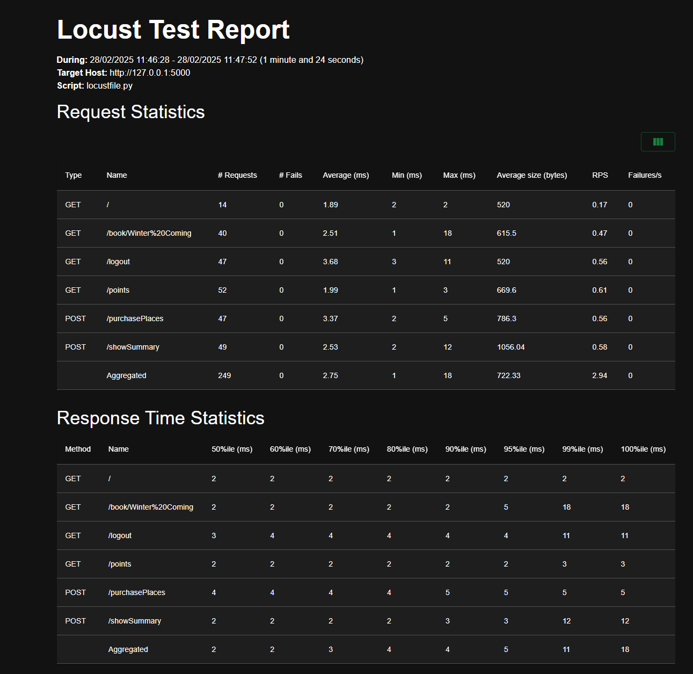

# Gudlift-registration

Python 3.12.6

# Why

This is a proof of concept (POC) project to show a light-weight version of our competition booking platform. The aim is the keep things as light as possible, and use feedback from the users to iterate.


# Installation

1. Clone the repository  or download it.
2. Open a terminal and navigate to the root of the repository.
3. Create virtual environment with ```python -m venv .venv```
4. Activate virtual environment with ```source .venv/bin/activate``` on Linux/iOS or ```.venv\Scripts\activate.bat``` on Windows.
5. Install dependencies ```pip install -r requirements.txt```
6. You can now run the project with ```flask run```

# Testing

You can run tests using **pytest**. Open a terminal, navigate to the root of the repository and run ```pytest``` or ```pytest -v``` for more detailed output.  
To check test coverage ```pytest --cov=.``` or ```pytest --cov=. --cov-report html``` to generate html report.


# Performance

You can test performance using **Locust**. Open a terminal, navigate to the root of the repository and run ```locust```.


